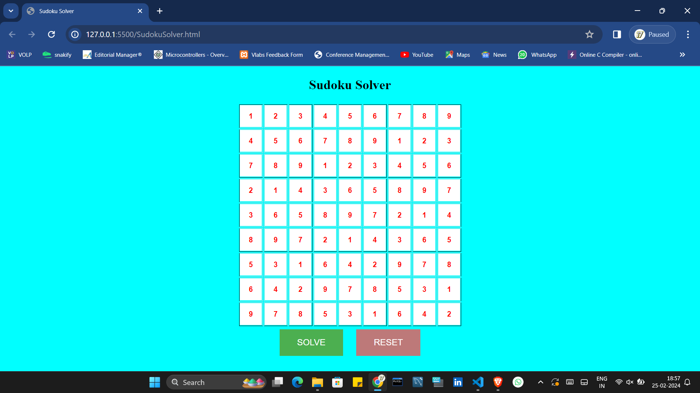

# Sudoku Solver



### Overview
This project is a Sudoku Solver implemented in HTML and JavaScript. It provides a web-based interface for users to input Sudoku puzzles and get solutions in real-time. The solver uses backtracking algorithm to efficiently find solutions for Sudoku puzzles of varying difficulty levels.

### Features
- Web-based Sudoku Solver
- Real-time solution generation
- Supports input of Sudoku puzzles
- Implements backtracking algorithm for efficient solving

### Usage
1. Open `index.html` in a web browser.
2. Input the Sudoku puzzle in the provided grid.
3. Click the "Solve" button to generate the solution.
4. The solution will be displayed in the grid.

### Installation
1. Clone this repository:
    ```bash
    git clone https://github.com/your_username/sudoku-solver.git
    ```
2. Open `index.html` in a web browser.

### File Structure
- `index.html`: HTML file for the Sudoku Solver web interface.
- `style.css`: CSS file for styling the web interface.
- `script.js`: JavaScript file containing the Sudoku solving logic.
- `placeholder_image.png`: Placeholder image for README.

### Technologies Used
- HTML
- CSS
- JavaScript

### Contributors
- Mahesh Sathe
  
### License
This project is licensed under the MIT License. See the [LICENSE](LICENSE) file for details.
